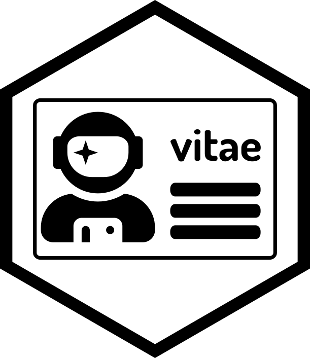

::: {.landing-hero}
{.landing-logo fig-alt="Quarto Vitae hex logo"}

# Quarto Vitae

Quarto extensions for writing CVs, résumés, and biographies.

::: {.callout-note}
## Work in progress

This site is still under construction. In the meantime, templates for Quarto
Vitae are available in the
[quarto-vitae GitHub organisation](https://github.com/orgs/quarto-vitae/repositories).
:::

::: {.landing-links}
[Browse templates on GitHub](https://github.com/orgs/quarto-vitae/repositories){.btn .btn-primary .btn-lg role="button"}
[Creating your own template](creating-templates.qmd){.btn .btn-outline-secondary .btn-lg role="button"}
:::
:::
